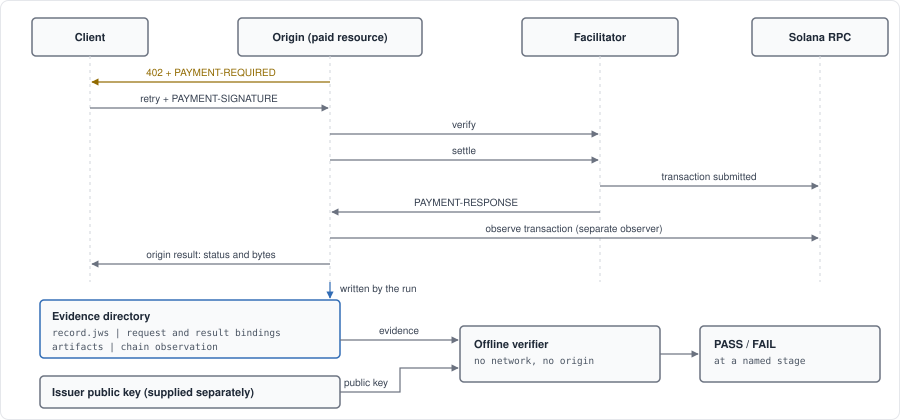

# x402 Solana Payment Evidence

Portable, offline-verifiable evidence for x402 v2 `exact` payment flows on Solana, using PEAC
Protocol records.

This is a reference implementation and interoperability corpus; it does not modify x402 or the PEAC
wire format or registries.

This example observes x402 payment field values, validates them in ordered stages using the upstream
x402 runtime validators, and binds them to the HTTP operation that was requested and to the bytes
the origin service produced.

Two paths run that pipeline. The deterministic path exercises the whole payment lifecycle in
process: a real express origin behind the real x402 payment middleware, a paying client, and a
facilitator injected into the run, over synthetic transaction artifacts rather than an onchain
payment. It needs no network and reproduces byte for byte, so the committed evidence in
`fixtures/expected-evidence/` can be verified from a checkout, from the files and a public key
alone. The second path runs the same evidence pipeline against a real payment on Solana Devnet; it
is a documented manual step, not part of continuous integration, and its live acceptance case is
pending.

Start with the [walkthrough](docs/WALKTHROUGH.md) for the full command path, the lifecycle state
machine and the devnet procedure.

## What this demonstrates

```text
x402 challenge -> SVM exact payment -> origin result -> native settlement artifact
-> PEAC signed evidence -> independent offline verification
```

- x402 v2, scheme `exact`, on SVM, denominated in Solana Devnet USDC.
- The HTTP operation associated with the payment interaction, as RFC 9421 request components the
  origin observed rather than components rebuilt by re-parsing a URL.
- The exact bytes the origin produced, covered by digest, so the PEAC evidence binds the recorded
  payment interaction to the work.
- Native x402 artifacts preserved verbatim and left authoritative for their own claims; this
  example digests and references them rather than reinterpreting them.
- A PEAC-signed record over those bindings, verifiable from the files and a public key alone: no
  network, no origin, no shared state with whatever produced the directory.
- The facilitator's settlement report and a separate Solana RPC observation of the same
  transaction, each attributed to whoever supplied it and never merged into a single account.
- A missing or altered artifact fails at a named stage, so a failure says which claim is no longer
  supported instead of condemning the directory as a whole.

## Why this exists

x402 defines the payment interaction, and native payment artifacts remain authoritative for those
semantics. Operational workflows can additionally need portable evidence tying that interaction to
the HTTP operation an origin observed, the result bytes it produced, the lifecycle outcome, and
independently attributed settlement observations.

This repository demonstrates that evidence path without changing x402, introducing an onchain
program, or replacing payment clients, wallets, facilitators, or Solana payment tooling.

## Evidence flow



The exchange across the top is x402's. What this example adds is the row beneath it: the directory
the run writes, and a verifier that reads that directory and a public key and nothing else. The two
observers of the settlement stay separate accounts throughout, and a failure names the stage rather
than condemning the directory.

## How this relates to x402

x402's signed offer and receipt extension produces signed proof-of-interaction artifacts for the
offer and for post-payment service context. This reference separately adds a PEAC-signed binding
over selected RFC 9421 HTTP request components, the exact origin-produced result bytes by digest,
digests of the native x402 artifacts, and explicit failure-state and presence semantics that can be
verified offline.

This evidence binding does not change the authorization semantics of the underlying x402 payment
proof or make that payment authorization request-bound.

The two are complementary, not corrective. This example adds two application-local documents and
nothing else:

| Profile | Binds |
|---|---|
| `org.peacprotocol.examples.payment-evidence/request-binding/1` | RFC 9421 request components, content type and encoding, request-body digest, selected observed-value digests |
| `org.peacprotocol.examples.payment-evidence/origin-result-binding/1` | status, content type and encoding, and the digest of the bytes the origin application produced |

Native x402 artifacts remain authoritative for their own claims. This example preserves, digests and
references them; it does not reinterpret settlement semantics or replace native signature checks.

## Staged validation

**Decoding is not validation.** The upstream `decode*Header` functions are transport decoders: they
accept any base64-encoded JSON object, including one with no x402 structure at all. Treating a
successful decode as "this is a valid x402 object" reports a transport fact as a schema fact.

Validation therefore runs as ordered stages. Each is reported independently as `accepted`,
`rejected` or `not_evaluated`, and a failure stops the sequence, so the report always names the
exact stage that refused the artifact.

```text
transport          strict standard base64, within the declared size bound
json               UTF-8 text the upstream decoder accepts as a JSON object
duplicate-members  no ambiguous object members
upstream-schema    the x402 v2 schema for this artifact type, evaluated by upstream code
scheme-payload     the scheme-specific payload member, for payment payloads
extensions         declared x402 extensions, evaluated by upstream extension APIs
```

### Validation authority per artifact

Every reported verdict names the authority that produced it. They are not interchangeable.

| Artifact | `upstream-schema` | Authority | Notes |
|---|---|---|---|
| `PAYMENT-REQUIRED` | evaluated | `@x402/core` v2 schema | |
| `PAYMENT-SIGNATURE` | evaluated | `@x402/core` v2 schema | plus a scheme-payload check, see below |
| `PAYMENT-RESPONSE` | **always `not_evaluated`** | local structural check | upstream ships no runtime validator for it |

For settle responses the upstream package exports no runtime validator at any export path. Rather
than invent one and label the result "x402 schema validation", this example reports a separate
`localStructuralStatus` under an explicitly local authority string. The import smoke test searches
every upstream export path for such a validator on every run, so if upstream adds one, the gate
fails and the local check must be replaced.

The scheme-payload stage exists because the upstream v2 schema types `scheme` as a free string and
`payload` as an open record. A payload naming an unsupported scheme, or carrying the wrong payload
member for the scheme it names, passes upstream schema validation. That check belongs to the scheme
profile, so this example performs it and reports it as its own stage rather than misattributing the
verdict to the upstream schema.

### Type-states

Capture and acceptance are separate operations, and the boundary is visible to the compiler rather
than being a flag a caller might forget to inspect:

```text
CapturedX402Artifact                       capture only; authorizes nothing
SchemaValidatedPaymentRequiredArtifact     requires upstream-schema accepted
SchemaValidatedPaymentPayloadArtifact      requires upstream-schema AND scheme-payload accepted
StructurallyCheckedSettleResponseArtifact  requires the local structural check accepted;
                                           upstream-schema stays not_evaluated
```

Promotion functions fail closed, and a captured artifact is not assignable where a validated one is
required. Preserving a malformed artifact is evidence; it is never authorization.

### Diagnostics

Failures are reported as at most eight `{stage, code, path}` entries, with path depth at most eight
and a total serialized size of at most one kibibyte. Codes come from a fixed vocabulary. No message
text produced by a validator over attacker-controlled input is retained, because that text can
embed the input itself.

## Duplicate members, I-JSON and JCS

RFC 8259 says object member names SHOULD be unique; it does not forbid duplicates, and `JSON.parse`
silently keeps the last occurrence. I-JSON (RFC 7493) does forbid them, and JCS (RFC 8785)
canonicalization is defined over I-JSON-compatible input.

This example canonicalizes decoded artifacts and binds the resulting bytes cryptographically, so an
object with ambiguous members must never reach canonicalization: two parsers could disagree about
which value the signed digest covers. A bounded scanner therefore tokenizes the decoded text,
decoding string escapes so that `"a"` and `"a"` are recognised as the same member name, and
refuses anything it cannot describe unambiguously.

**This is a PEAC binding-safety requirement, not an x402 conformance rule.** x402 does not declare
duplicate members invalid, and a `duplicate-members` rejection is never an upstream verdict.

## Representation taxonomy

Every digest names what it covers:

```text
observed       the exact field value at the APPLICATION CAPTURE BOUNDARY, preserved without
               decode-and-re-encode substitution
decoded        the base64-decoded payload bytes
validated      an object accepted by a stated validation authority, canonicalized with JCS
```

`observed` means the value as the application framework exposed it after HTTP parsing. It is **not**
raw TCP or TLS bytes, and nothing here should be read as wire-level preservation. The accepted field
value passes a visible-ASCII gate and is then digested as UTF-8 bytes.

Two result digests exist and are never conflated:

- `bodyDigest` on the origin result binding covers bytes the origin produced **before transfer
  encoding or gateway transformation**. This is what the issuer can attest.
- A client-observed digest, if any, is reported by that client and is **not** signed here. The
  origin cannot observe what survived compression, transfer encoding or a CDN.

## Verifying evidence you were handed

`pnpm verify` with no arguments checks the committed fixture under its test key. Any other evidence
directory needs the key it was signed under, supplied explicitly:

```bash
pnpm verify -- --evidence out/devnet-<runId> --public-key out/devnet-<runId>-issuer.pub.json
```

Both options are required together. `--evidence` alone would fall back to the fixture's test key,
and a directory that failed for that reason would read as tampering rather than as the wrong key.

The key file is JSON: `{"algorithm":"Ed25519","kid":...,"issuer":...,"publicKey":<64 hex chars>}`.
A live run writes one beside the directory it belongs to and prints the exact command above. Only
the public half is ever written.

**A supplied public key makes the record cryptographically verifiable. It is not an independently
trusted identity.** It says nothing about who holds the matching private key, and a key obtained
from the same place as the evidence establishes internal consistency only. An identity claim needs a
key obtained through a channel independent of the evidence, and this example provides none.

The algorithm, key identifier and issuer the key file declares are checked against the record and
reported as three separate named checks. Agreement means the file describes the key that signed the
record; it is still consistency, and never identity.

## What verification establishes

Successful verification establishes that a signed record has not been altered since it was signed,
and that the signer possessed the private key corresponding to the public key supplied to the
verifier.

It does **not** establish:

- that the key, or its holder, is trustworthy, or that the key represents any particular
  organization;
- that the statements inside the record are factually true;
- that any external event described by the record actually occurred.

Chain facts are issuer observations: a service records a transaction and the conditions under which
it treated a payment as settled. Verification establishes the integrity of that report; it does not
independently establish blockchain consensus, and it does not make the issuer's account of events
authoritative.

A live run also records what a Solana RPC endpoint reported about the same transaction, as a
separate observation naming that endpoint, the slot and the commitment level it gave. Two accounts
are not a consensus claim: the record says who was asked and what they said, and anyone can check
the transaction reference against the network themselves.

The two can disagree. If the facilitator reported settlement success and the node reported that
transaction with an execution error, verification prints the disagreement as a warning and the
evidence still verifies. Warnings are reported separately from the checks and never change the
verdict: integrity is a question about bytes and a key, and deciding which observer was right would
mean promoting one account to a fact about the network. An observation that could not be made is
recorded as unavailable and is never written up as a second observer confirming the first.

## Request components

Components follow RFC 9421 derived-component semantics and are taken from the message as the origin
observed it:

```text
@method      preserved exactly; HTTP methods are case-sensitive
@scheme      lowercased
@authority   host lowercased, default port for the scheme omitted
@path        percent-encoded octets and dot segments preserved verbatim
@query       includes the leading "?"; a request with no query yields "?"
```

They are never rebuilt by re-parsing an absolute URL, for two reasons. URL parsers normalise:
collapsing dot segments, rewriting percent-encoding and reordering queries, any of which changes the
operation the evidence describes. And reconstructing scheme or authority from client-supplied
headers would let a caller influence what the record says. Adapters pass trusted components
explicitly, together with a `proxyTrustProfile`. Behind a reverse proxy, configure the framework's
proxy trust before treating a forwarded scheme or authority as trusted.

## Byte semantics

- Bodies are `Uint8Array`. A string would carry an implied encoding into the digest.
- x402 payment field values must be visible ASCII, and are digested as UTF-8 bytes.
- Header decoding is delegated to the installed x402 codec, which uses standard base64 JSON for
  `PAYMENT-REQUIRED`, `PAYMENT-SIGNATURE` and `PAYMENT-RESPONSE`. This example does not define its
  own transport encoding.
- `payment-identifier` is an x402 **extension** carried inside `PaymentPayload.extensions`, not a
  fourth HTTP field. It is extracted and validated with the upstream extension APIs.
- Size bounds are application-local choices made by this example. They are not derived from, and
  imply nothing about, any HTTP parser limit.

## Scope and state

This is a reference example, not a product with a support contract. The table says what it
demonstrates and how far each part has actually been exercised.

| Item | State |
|---|---|
| reference scope | x402 v2 |
| demonstrated scheme | `exact` |
| SVM (Solana) artifacts and identifiers | covered by this reference |
| field-value capture and staged validation | implemented |
| request binding and origin-result binding | implemented |
| deterministic validation vectors and rejection corpus | implemented |
| offline x402 lifecycle reference | implemented, deterministic, no onchain payment |
| live Solana Devnet USDC payment | acceptance pending; the manual procedure is in the [walkthrough](docs/WALKTHROUGH.md) |
| separate Solana RPC observation | implemented for the live run; optional, and recorded as unavailable when the endpoint cannot answer |
| PEAC signed record issuance | implemented |
| offline verification from files and a public key | implemented |
| tamper detection | implemented |
| settlement observation and chain-observation documents | implemented |
| scheme `upto` | out of scope |
| batch settlement | out of scope |
| streaming responses | out of scope |
| mainnet | out of scope |
| MCP carriers | out of scope |
| EVM networks | out of scope |

## Quickstart

Node 24 LTS is the recommended reference runtime; CI also covers Node 22. Corepack is bundled
through Node 24; on Node 25 or newer, install Corepack separately before using the pinned pnpm
command below.

```bash
corepack pnpm@8.15.0 install --frozen-lockfile
corepack pnpm@8.15.0 test

# or, with the pinned pnpm on PATH after `corepack enable`:
pnpm install --frozen-lockfile
pnpm test           # every suite, both typechecks and the acceptance matrix
pnpm demo:fixture   # the offline end-to-end run; writes and verifies the committed evidence
pnpm verify         # verify that evidence from the files and a public key alone
pnpm tamper-demo    # edit one bound field in a copy and watch verification name the failure

# any evidence directory, under any supplied key
pnpm verify -- --evidence <dir> --public-key <file>
```

Then read the [walkthrough](docs/WALKTHROUGH.md) for the lifecycle, the artifact presence contract
and the Solana devnet procedure.

## Run

```bash
corepack enable

pnpm install --frozen-lockfile   # exact versions from the lockfile
pnpm test                        # the full gate: every line below, in order, stopping at the first failure
pnpm test:imports                # upstream export paths and exact version pins
pnpm test:golden                 # deterministic validation vectors and staged-validation reporting
pnpm test:negative               # rejection corpus
pnpm test:keys                   # key creation, persistence and fail-closed loading
pnpm test:preflight              # preflight revalidation and recipient validation
pnpm test:flow                   # offline end-to-end run and the lifecycle failure branches
pnpm test:svm                    # security, replay, binding and tamper cases
pnpm test:evidence               # verifying an evidence directory under a supplied public key
pnpm test:verifier-inputs        # hostile inputs handed to the verifier: bounds, file types, links
pnpm typecheck                   # TypeScript 7, primary
pnpm typecheck:compat            # TypeScript 6, compatibility gate
pnpm test:acceptance             # every declared acceptance case executed
pnpm demo:binding                # deterministic binding walkthrough
pnpm demo:fixture                # offline end-to-end run, writes fixtures/expected-evidence
pnpm demo:offline                # binding walkthrough with egress diagnostics installed
pnpm verify                      # verify the committed evidence
pnpm tamper-demo                 # tamper demonstration, exits non-zero if an edit is not caught
pnpm demo:devnet:prepare         # devnet preflight, fails closed with funding instructions
pnpm demo:devnet                 # live devnet run, spends devnet funds, writes evidence to out/
pnpm gen:golden                  # regenerate the vectors, then review the diff
```

Deterministic validation vectors live in `fixtures/golden-v1.json` with hard-coded expected bytes
and digests, and are cross-checked against a second, independently written RFC 8785 implementation.
Both binding documents validate against closed JSON Schema 2020-12 files in `schemas/`.

Acceptance cases carry stable identifiers declared in `src/acceptance-ids.ts`. The suites record
each one as it executes and `pnpm test:acceptance` fails if a declared case did not run, so
coverage cannot regress while the counts keep looking healthy. Four cases are scoped to continuous
integration, because a single local process cannot reproduce them: two repeated-run byte
comparisons and two runs with networking disabled. One case is scoped to live acceptance and is
reported as pending until someone performs a devnet run, never as a result.

One case is deliberately narrower than its name suggests, and the registry says so where it is
declared: whether an SVM fee payer is isolated from the transfer it pays for is decided by the
upstream facilitator against a real transaction, so what is asserted locally is the property this
integration owns, which is that the fee payer never becomes a party to the payment.

Fixtures are synthetic. Network and asset identifiers are the public Solana devnet constants
exported by the upstream package; every payer, recipient, fee payer, transaction and signature value
is fabricated placeholder text.

## Privacy

Payment signatures, payer identifiers, receipts and transaction references can be sensitive. Public
evidence is digest-only by default; raw artifacts stay private outside fixture mode. No private key
or payment authorization belongs in this repository, its logs, or a recorded demonstration.

## Licence

Apache-2.0
